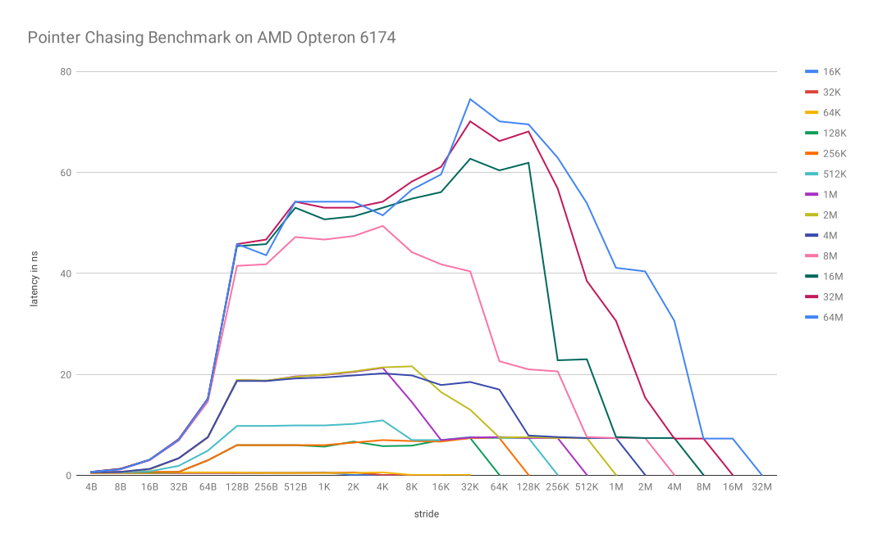
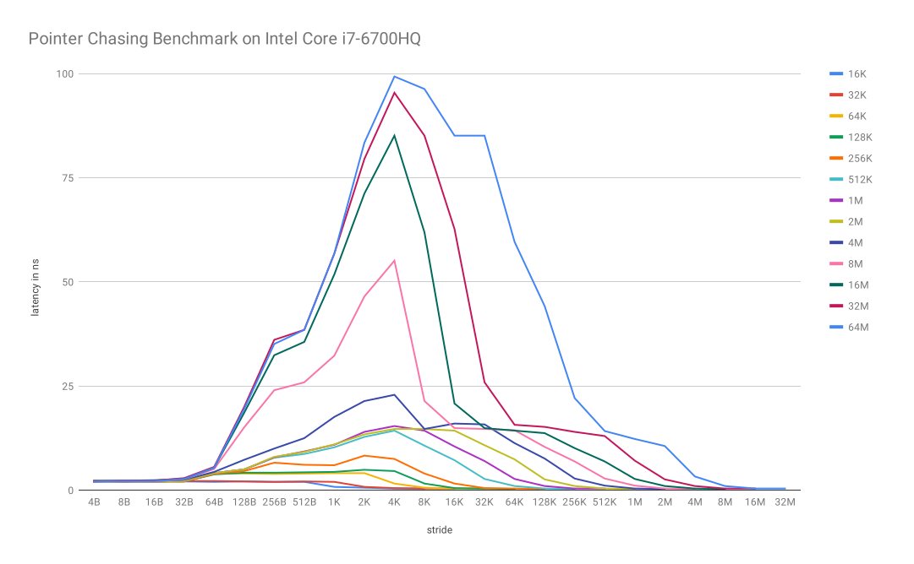
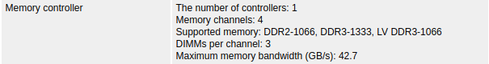
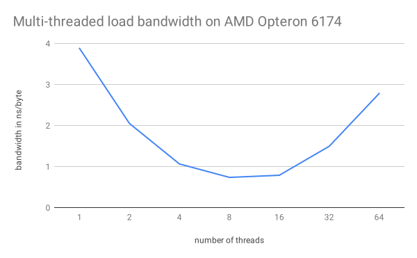
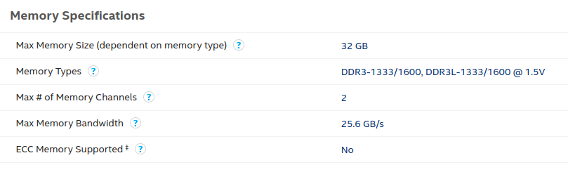
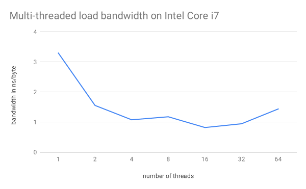

# Advanced Parallel Computing
*06.05.2019*  

**Students:**  
Jona Neef  
Nikolas Krätzschmar  
Philipp Walz  

## Exercise 2

### 2.1 Reading

#### Christoph Lameter. 2013. An overview of non-uniform memory access.
In the paper "An Overview of Non-Uniform Memory Access" Christoph Lameter describes the Non-Uniform Memory Accesses, which are available in almost every system today, because each processor has its own memory very close to the execution unit due to its performance.

Numa Support optimizes process execution in most cases without the user having to intervene. However, there are also additional Numa Configuration Tools, which are mainly used in high performance applications, where very good knowledge of the hardware and software is required.

I accept the contents of the paper, because the NUMA problem is described very well at the beginning and also a deeper insight is given, how the whole thing is used in Linux.

#### Fabien Gaud. 2015. Challenges of memory management on modern NUMA systems. 

In their paper "Challenges of memory management on modern NUMA systems", the team around Fabien Gaud evaluates characteristics and features of non-uniform memory access systems.

First, the authors give a brief introduction to the topic with an example of a modern NUMA system consisting of four nodes and various interconnect links. It is explained that current x86 NUMA systems are cache coherent which supports compatibility but also aggravates performance. Although remote accesses on modern NUMA systems take only 30% longer than local accesses, this latency can increase extremely if congestions appear on the memory controller or on the interconnect.

Furthermore, they give a detailed explanation about conducted experiments that compare performance differences between single- and multi-threaded applications on NUMA systems. 
Because single-threaded applications did not produce memory congestion, the difference between local- and remote accesses stayed in a range of 20%.

On the other hand, with multi-threaded applications, the two NUMA policies first-touch and interleave have a great effect on performance. The paper shows that the first-touch policy (which is used in Linux by default) improves locality, but it can also increase the imbalance of memory allocations among different nodes. This can cause memory congestions, which further reduces overall performance.

Finally, the authors propose different solution approaches such as manual NUMA policy optimizations, AutoNUMA and Carrefour, a memory-placement algorithm with focus on traffic management.

The paper concludes with the prediction that the growing amount of cores per NUMA system cause that these performance effects will continue to be a concern in the future.

We strongly accept the authors work and share their opinion that NUMA effects play a major role in performance evaluations and optimizations. Furthermore we think that not only OS developers but also application software developers should consider these architectural impacts in their code.


### 2.2 Pointer Chasing Benchmark

**Definition: Array Size vs. Element Count**  
  - `ARRAY_MIN`:  Minimum element count of array
  - `ARRAY_MAX`:  Maximum element count of array
  - `ARRAY_SIZE`: Actual size in bytes of the data array (`element count * sizeof(int)`)

```
ARRAY_MIN = 4 * 1024 element count    => ARRAY_SIZE = 16K   
ARRAY_MAX = 16384 * 1024 elementcount => ARRAY_SIZE = 64M
```

#### 1) moore (AMD Opteron 6174)

**AMD Opteron 6174 Specification**

```
apc09@moore:~$ lscpu
Architecture:          x86_64
CPU op-mode(s):        32-bit, 64-bit
Byte Order:            Little Endian
CPU(s):                48
On-line CPU(s) list:   0-47
Thread(s) per core:    1
Core(s) per socket:    12
Socket(s):             4
NUMA node(s):          8
Vendor ID:             AuthenticAMD
CPU family:            16
Model:                 9
Model name:            AMD Opteron(tm) Processor 6174
Stepping:              1
CPU MHz:               2200.000
BogoMIPS:              4402.14
Virtualization:        AMD-V
L1d cache:             64K
L1i cache:             64K
L2 cache:              512K
L3 cache:              5118K
NUMA node0 CPU(s):     0-5
NUMA node1 CPU(s):     6-11
NUMA node2 CPU(s):     12-17
NUMA node3 CPU(s):     18-23
NUMA node4 CPU(s):     24-29
NUMA node5 CPU(s):     30-35
NUMA node6 CPU(s):     36-41
NUMA node7 CPU(s):     42-47
```

**Additional specs from AMD data sheet:**  

| Description             | Value             |
| ----------------------- | ----------------- |
| Main Memory Access Time | 56 ns             |
| TLB miss penalty        | 80 cycles = 36 ns |
| TLB/Cache associativity | direct mapped     |


**Results**

|     | 4B | 8B | 16B | 32B | 64B | 128B | 256B | 512B | 1K | 2K | 4K | 8K | 16K | 32K | 64K | 128K | 256K | 512K | 1M  | 2M  | 4M | 8M | 16M | 32M |
| --- | -- | -- | --- | --- | --- | ---- | ---- | ---- | -- | -- | -- | -- | --- | --- | --- | ---- | ---- | ---- | --- | --- | -- | -- | --- | --- |
| 16K | 0.5 | 0.5 | 0.5 | 0.5 | 0.5 | 0.5 | 0.5 | 0.5 | 0.6 | 0.1 | 0.1 | 0.1 |  |  |  |  |  |  |  |  |  |  |  | 
| 32K | 0.5 | 0.5 | 0.5 | 0.5 | 0.5 | 0.5 | 0.5 | 0.5 | 0.5 | 0.6 | 0.1 | 0.1 | 0.1 |  |  |  |  |  |  |  |  |  |  | 
| 64K | 0.5 | 0.5 | 0.5 | 0.6 | 0.6 | 0.6 | 0.5 | 0.5 | 0.5 | 0.5 | 0.6 | 0.1 | 0.1 | 0.1 |  |  |  |  |  |  |  |  |  | 
| 128K | 0.6 | 0.6 | 0.6 | 0.7 | 3 | 6 | 6 | 6 | 5.7 | 6.7 | 5.8 | 5.9 | 7 | 7.4 | 0.1 |  |  |  |  |  |  |  |  | 
| 256K | 0.6 | 0.6 | 0.7 | 0.7 | 3 | 6 | 6 | 6 | 6 | 6.5 | 7 | 6.8 | 6.7 | 7.4 | 7.4 | 0.1 |  |  |  |  |  |  |  | 
| 512K | 0.6 | 0.6 | 0.8 | 1.9 | 4.9 | 9.8 | 9.8 | 9.9 | 9.9 | 10.2 | 10.9 | 7 | 7 | 7.6 | 7.4 | 7.4 | 0.1 |  |  |  |  |  |  | 
| 1M | 0.6 | 0.7 | 1.2 | 3.4 | 7.5 | 18.9 | 18.7 | 19.6 | 19.9 | 20.5 | 21.3 | 14.5 | 7 | 7.5 | 7.6 | 7.4 | 7.4 | 0.1 |  |  |  |  |  | 
| 2M | 0.6 | 0.7 | 1.2 | 3.4 | 7.5 | 18.9 | 18.8 | 19.5 | 20 | 20.6 | 21.4 | 21.6 | 16.5 | 13 | 7.5 | 7.6 | 7.4 | 7.4 | 0.1 |  |  |  |  | 
| 4M | 0.6 | 0.7 | 1.3 | 3.4 | 7.6 | 18.7 | 18.7 | 19.2 | 19.4 | 19.8 | 20.2 | 19.8 | 17.9 | 18.5 | 17 | 7.9 | 7.6 | 7.4 | 7.4 | 0.1 |  |  |  | 
| 8M | 0.7 | 1.2 | 3 | 6.9 | 14.6 | 41.5 | 41.8 | 47.2 | 46.7 | 47.4 | 49.4 | 44.2 | 41.8 | 40.4 | 22.6 | 21 | 20.6 | 7.6 | 7.4 | 7.4 | 0.1 |  |  | 
| 16M | 0.7 | 1.3 | 3.1 | 7.1 | 15.2 | 45.4 | 45.8 | 53 | 50.7 | 51.3 | 53 | 54.8 | 56.1 | 62.7 | 60.4 | 61.9 | 22.8 | 23 | 7.6 | 7.4 | 7.4 | 0.1 |  | 
| 32M | 0.7 | 1.3 | 3.1 | 7.2 | 15.2 | 45.8 | 46.7 | 54.2 | 53 | 53 | 54.2 | 58.2 | 61.1 | 70.1 | 66.2 | 68.1 | 56.8 | 38.5 | 30.6 | 15.4 | 7.3 | 7.3 | 0.1 | 
| 64M | 0.7 | 1.2 | 3.1 | 7.1 | 15.1 | 45.8 | 43.6 | 54.2 | 54.2 | 54.2 | 51.5 | 56.6 | 59.6 | 74.5 | 70.1 | 69.5 | 62.9 | 53.9 | 41.1 | 40.4 | 30.6 | 7.3 | 7.3 | 0.1 |





**Analysis**  
The chart shows the latency distribution of the pointer chasing benchmark. The stride is plotted on the x-axis while the different plot lines represent the various array sizes.

First we noticed, that the L1 cache size of 64 KB is clearly visible:
Because array sizes of less than 64KB perfectly fit into the L1 chache, the access latencies never increase to more than 1.

However as soon as the array size is largere as the L1 cache size, access latencies  

#### 2) Intel Core i7-67000HQ

**Intel Core i7-67000HQ Specification**

```
jona@jona-N501VW:~$ lscpu
Architecture:        x86_64
CPU op-mode(s):      32-bit, 64-bit
Byte Order:          Little Endian
CPU(s):              8
On-line CPU(s) list: 0-7
Thread(s) per core:  2
Core(s) per socket:  4
Socket(s):           1
NUMA node(s):        1
Vendor ID:           GenuineIntel
CPU family:          6
Model:               94
Model name:          Intel(R) Core(TM) i7-6700HQ CPU @ 2.60GHz
Stepping:            3
CPU MHz:             3290.724
CPU max MHz:         3500,0000
CPU min MHz:         800,0000
BogoMIPS:            5184.00
Virtualization:      VT-x
L1d cache:           32K
L1i cache:           32K
L2 cache:            256K
L3 cache:            6144K
NUMA node0 CPU(s):   0-7
```


**Results**

|     | 4B | 8B | 16B | 32B | 64B | 128B | 256B | 512B | 1K | 2K | 4K | 8K | 16K | 32K | 64K | 128K | 256K | 512K | 1M  | 2M  | 4M | 8M | 16M | 32M |
| --- | -- | -- | --- | --- | --- | ---- | ---- | ---- | -- | -- | -- | -- | --- | --- | --- | ---- | ---- | ---- | --- | --- | -- | -- | --- | --- |
| 16K | 2.1 | 2.1 | 2.1 | 2.1 | 2 | 2.1 | 2 | 2 | 0.8 | 0.6 | 0.4 | 0.4 |  |  |  |  |  |  |  |  |  |  |  | 
| 32K | 2.3 | 2.2 | 2.1 | 2.2 | 2.2 | 2.1 | 2 | 2.1 | 2 | 0.8 | 0.5 | 0.4 | 0.4 |  |  |  |  |  |  |  |  |  |  | 
| 64K | 2.1 | 2.1 | 2.1 | 2.2 | 4 | 4 | 3.9 | 4 | 4.1 | 4.1 | 1.6 | 0.6 | 0.4 | 0.4 |  |  |  |  |  |  |  |  |  | 
| 128K | 2.1 | 2.1 | 2.1 | 2.1 | 3.8 | 4.2 | 4.2 | 4.3 | 4.4 | 4.9 | 4.6 | 1.6 | 0.5 | 0.4 | 0.3 |  |  |  |  |  |  |  |  | 
| 256K | 2.1 | 2.1 | 2.1 | 2.1 | 3.9 | 4.6 | 6.6 | 6.1 | 6 | 8.3 | 7.5 | 4 | 1.6 | 0.5 | 0.4 | 0.3 |  |  |  |  |  |  |  | 
| 512K | 2.1 | 2.1 | 2.1 | 2.2 | 4.1 | 5 | 7.8 | 8.7 | 10.3 | 12.8 | 14.3 | 10.7 | 7.2 | 2.7 | 1 | 0.4 | 0.3 |  |  |  |  |  |  | 
| 1M | 2.1 | 2.1 | 2.1 | 2.2 | 4.1 | 5 | 7.9 | 9.3 | 10.9 | 14 | 15.4 | 14.3 | 10.5 | 7 | 2.7 | 1 | 0.4 | 0.4 |  |  |  |  |  | 
| 2M | 2.1 | 2.1 | 2.1 | 2.2 | 4.1 | 5 | 8 | 9.2 | 11 | 13.4 | 14.7 | 14.7 | 14.3 | 10.8 | 7.4 | 2.6 | 1 | 0.4 | 0.3 |  |  |  |  | 
| 4M | 2.2 | 2.1 | 2.2 | 2.5 | 4.4 | 7.3 | 10 | 12.5 | 17.6 | 21.4 | 22.9 | 14.7 | 16 | 15.8 | 11.3 | 7.6 | 2.8 | 1.1 | 0.4 | 0.3 |  |  |  | 
| 8M | 2.1 | 2.1 | 2.2 | 2.6 | 5.1 | 15.1 | 24 | 25.9 | 32.3 | 46.5 | 55.1 | 21.4 | 14.9 | 14.7 | 14.4 | 10.4 | 6.9 | 2.8 | 1.1 | 0.4 | 0.3 |  |  | 
| 16M | 2.2 | 2.3 | 2.4 | 2.7 | 5.4 | 18.6 | 32.4 | 35.6 | 51.8 | 71.2 | 85.1 | 61.9 | 20.8 | 14.9 | 14.3 | 13.7 | 10.1 | 6.9 | 2.7 | 1 | 0.4 | 0.3 |  | 
| 32M | 2.1 | 2.3 | 2.3 | 2.9 | 5.6 | 20 | 36.1 | 38.5 | 56.8 | 79.5 | 95.4 | 85.1 | 62.7 | 25.9 | 15.7 | 15.2 | 14 | 13 | 7.1 | 2.6 | 1 | 0.4 | 0.4 | 
| 64M | 2.1 | 2.2 | 2.2 | 2.7 | 5.4 | 19.5 | 35.1 | 38.5 | 56.8 | 83.4 | 99.3 | 96.3 | 85.1 | 85.1 | 59.6 | 44.2 | 22.1 | 14.2 | 12.3 | 10.6 | 3.3 | 1 | 0.4 | 0.4




**Analysis**  
The chart shows the latency distribution of the pointer chasing benchmark. The stride is plotted on the x-axis while the different plot lines represent the various array sizes.

First we noticed, that the L1 cache size of 64 KB is clearly visible:
Because array sizes of less than 64KB perfectly fit into the L1 chache, the access latencies never increase to more than 1.

However as soon as the array size is largere as the L1 cache size, access latencies  

### 2.3 Multi-threaded load bandwidth

#### 1) moore (AMD Opteron 6174)




#### 2) Intel Core i7-67000HQ





