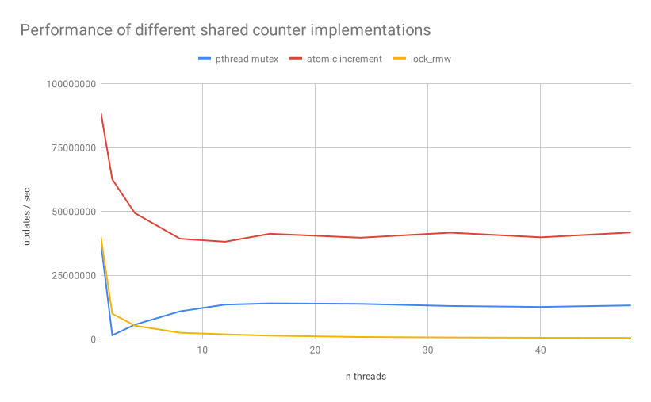

# Advanced Parallel Computing
*13.05.2019*  

**Students:**  
Jona Neef  
Nikolas Krätzschmar  
Philipp Walz  

## Exercise 3

### 3.1 Reading

#### David A. Wood and Mark D. Hill. 1995. Cost-Effective Parallel Computing. 
In the paper "Cost-Effective Parallel Computing", David A. Wood and Mark D. Hill show in which cases multiprocessor systems are financially worthwhile, even if no linear speedup is available.

They show that this mainly depends on memory. If a processor does not provide enough performance, you should use multiple processors instead to utilize the full memory capacity and bandwidth.

I accept their statement, even though the paper was written a few years ago and parallel systems are now needed to keep track of Amdahl's Law, as the performance of a single processor can no longer be achieved by increasing the clock frequency. I think it's good that even at that time they didn't just use the pure speedup as a basis, but also referred to the total costs for the respective performance.

#### P. Stenstrom. A survey of cache coherence schemes for multiprocessors. 

In the paper "A survey of cache coherence schemes for multiprocessors" Per Stenström describes different approaches to solve the cache coherence problem which arrises in modern shared-memory multiprocessor systems.

Stenström names three distinct problems that contribute to an increased memory access time of multiprocessor systems: memory contention, communication contention and latency time. He describes that caches can solve these problems by improving temporal and spacial locality of memory references. However caches inherently bring new complexities such as cache coherence and cache organization.

The author first gives two example problems: the bounded-buffer producer/consumer problem and a parallel algorithm for solving linear system of equations by iteration. Both examples make use of shared data and have to consider some scheme for cache coherence.

Therefore Stenström examines hardware cache protocols, such as snoopy cache protocols, directory schemes, and cache-coherent network architectures. Lastly he investigates software schemes as an alternative approach to reduce hardware cost.

Although the influence of software schemes for cache coherence is negligible these days as hardware cost sunk massively, we still accept the authors findings. In our opinion it is remarkable that the authors research, performed almost three decades ago, is still such a prominent topic in the field of parallel computing. 


###  3.2 and  3.3 Result Validation

```
   naive 0000167096 != 0003145728
   mutex 0003145728 == 0003145728
 atomics 0003145728 == 0003145728
lock_rmw 0003145728 == 0003145728
```

### 3.4 Shared Counter Performance Analysis

| benchmark     | mutex             |                   | atomics           |                   | lock_rmw          |                   |
| ------------- | ----------------- | ----------------- | ----------------- | ----------------- | ----------------- | ----------------- |
| **n threads** | **exec time (s)** | **updates / sec** | **exec time (s)** | **updates / sec** | **exec time (s)** | **updates / sec** |
| 1             | 0.052281          | 37606275.49       | 0.022226          | 88459664.51       | 0.049481          | 39734045.75       |
| 2             | 1.312696          | 1497742.43        | 0.031424          | 62566669.30       | 0.197635          | 9948017.95        |
| 4             | 0.347515          | 5657533.61        | 0.039829          | 49363274.82       | 0.373007          | 5270899.19        |
| 8             | 0.180942          | 10865793.23       | 0.050018          | 39307480.75       | 0.787580          | 2496355.78        |
| 12            | 0.145745          | 13489839.75       | 0.051579          | 38117686.42       | 1.049237          | 1873818.48        |
| 16            | 0.140661          | 13977469.99       | 0.047675          | 41239497.26       | 1.459241          | 1347330.39        |
| 24            | 0.142587          | 13788654.23       | 0.049538          | 39688136.61       | 2.396090          | 820536.75         |
| 32            | 0.151801          | 12951688.22       | 0.047186          | 41666666.67       | 3.109717          | 632237.65         |
| 40            | 0.156228          | 12584650.41       | 0.049341          | 39846604.52       | 3.775028          | 520811.99         |
| 48            | 0.149084          | 13187724.69       | 0.047092          | 41750066.96       | 4.111867          | 478147.73         |


