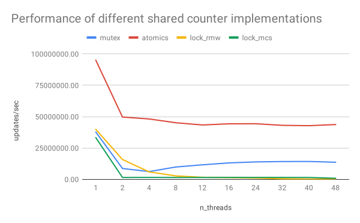

# Advanced Parallel Computing
*20.05.2019*  

**Students:**  
Jona Neef  
Nikolas Krätzschmar  
Philipp Walz  

## Exercise 4

### 4.1 Reading

#### Alain Kägi, Doug Burger, and James R. Goodman. 1997. Efficient synchronization: let them eat QOLB. 

In their paper, Alain Kägi, Doug Burger and James R. Goodman compare many different synchronizations and apply optimization mechanisms to them. They show that, contrary to many previous statements by other scientists, QOLB synchronization is much faster than other synchronization methods (outperforms MCS by 40%).

The most important finding was that QOLB is not completely prohibitive despite the more complex implementation into the hardware and it will still be worth it due to the enormous performance gains (especially together with collocation).

I accept the authors' statement that QOLB can be much faster than many other synchronization methods and that the optimization mechanisms can be best applied to it. However, QOLB is not as relevant today as it was advertised in the paper several years ago. This is probably due to the rather complex way in which QOLB has to be implemented.


#### José L. Abellán, Juan Fernández and Manuel E. Acacio. GLocks: Efficient Support for Highly-Contended Locks in Many-Core CMPs. 


###  4.2 Result Validation

```
   naive 0000155437 != 0003145728
   mutex 0003145728 == 0003145728
 atomics 0003145728 == 0003145728
lock_rmw 0003145728 == 0003145728
lock_mcs 0003145728 == 0003145728
```

### 3.4 Shared Counter Performance Analysis

| benchmark |            mutex   |                    |          atomics   |                    |      lock_rmw      |                    |      lock_mcs      |        |
| ------------- | ----------------- | ----------------- | ----------------- | ----------------- | ----------------- | ----------------- | ----------------- | ----------------- |
| **n threads** |    **exec time (s)**   |    **updates / sec**   |    **exec time (s)**   |    **updates / sec**  |    **exec time (s)**   |    **updates / sec**   |    **exec time (s)**   |    **updates / sec** |
|       1   |         0.052172   |      37684704.56   |         0.020702   |      94969291.05   |         0.049340   |      39847470.25   |         0.059179   |      33222715.99|
|       2   |         0.226226   |       8690769.99   |         0.039558   |      49701547.53   |         0.123922   |      15865430.47   |         1.289945   |       1524157.55 |
|        4   |         0.315961   |       6222548.57   |         0.040811   |      48175592.74   |         0.329265   |       5971120.48   |         1.251209   |       1571344.62 |
|        8   |         0.199254   |       9867212.60   |         0.043529   |      45167640.48   |         0.704877   |       2789251.46   |         1.315297   |       1494779.99|
|       12   |         0.169250   |      11616432.82   |         0.045304   |      43397406.28   |         1.162246   |       1691621.66   |         1.283388   |       1531945.13|
|       16   |         0.149494   |      13151568.83   |         0.044367   |      44313756.49   |         1.432428   |       1372550.71   |         1.268330   |       1550133.41|
|       24   |         0.141083   |      13935589.11   |         0.044300   |      44380570.53   |         1.850044   |       1062720.49   |         1.271577   |       1546174.74|
|       32   |         0.138092   |      14237439.41   |         0.045614   |      43102349.29   |         3.953425   |        497310.58   |         1.273628   |       1543684.50|
|       40   |         0.137583   |      14290107.47   |         0.045915   |      42820086.73   |         7.756291   |        253481.98   |         1.290627   |       1523353.07|
|       48   |         0.143832   |      13669283.11   |         0.044959   |      43730745.41   |         8.347212   |        235537.34   |         2.169427   |        906266.89|            906266.89


