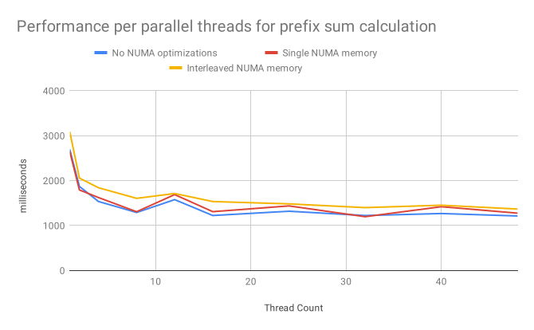

# Advanced Parallel Computing
*11.06.2019*  
**Students:**  
Jona Neef  
Nikolas Krätzschmar  
Philipp Walz  

## Exercise 6

### 6.1 Reading

#### Calin Cascaval 2008. Software Transactional Memory: Why Is It Only a Research Toy?

In their paper Călin Caşcaval and his colleagues present a new software transactional memory framework from IBM and compare it with the Intel STM and Sun TL2 STM. They also discuss the various problems involved in programming with TM, including both HTM and STM.

The main finding was that performance was very poor in all STM implementations. While with the k-means algorithm the IBM STM implementation achieved a single threaded performance with at least 4 cores, this was not possible with vacations for any of the implementations, not even with 8 cores. The developers explain this by the enormous overhead of the TM and analyze it with regard to the different STM operations. Especially read and write barriers do not perform well, which is the reason why further research should try to minimize them.

I accept the opinion of the authors that the enormous complexity generated by TM programming (whether in hardware or software) ultimately reduces productivity and makes it difficult to use it outside of research work.

#### Aleksandar Dragojevic 2011. Why STM can be more than a research toy. 

In their paper "Why STM can be more than a research toy" Dragojevic et. al. show that in contrast to the findings of Cascaval et al. transactional memory (TM) does have its reason for existance, if used in a hybrid software-hardware implementation, and can often outperform sequential, nontransactional code.

To evaluate TM's viability based on their level of overhead and level of speedup. Their key insight is that parallel applications exhibiting high contention are not the primary target for STM therefore they shouldn't be used as a benchmark.

Secondly the authors show that features like compiler instrumentation and explicit, nontransparent privatization leverate transactional memory to a degree that outperforms sequential code in every but one tested workload.

We strongly agree with the authors work. In our opinion it is always a matter of where to set the benchmark. For sure transactional memory has severe downsides compared with other advanced parallel mechanisms. However for the typical programmer without special knowledge of parallel programming, TM delivers easy-to-use interface that could be build into a wide range of future comodity software.

### 6.3 Parallel Prefix Sum Analysis

